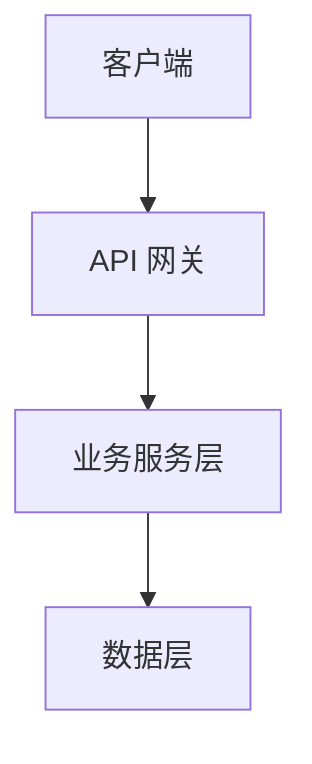
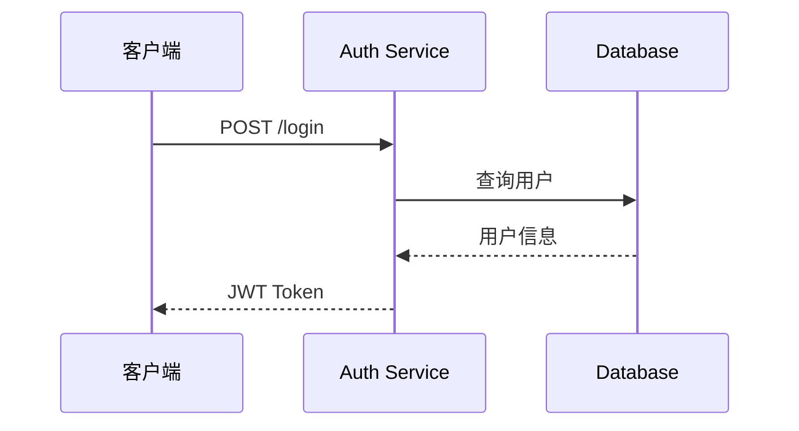
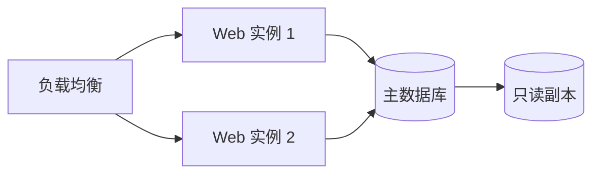

# ARCHITECTURE.md 编写规范

## 创建时机

首个非平凡模块出现时创建。架构变更时更新。

## 文件位置

`docs/ARCHITECTURE.md`

## 模板

```markdown
# 架构设计

> 最后更新：YYYY-MM-DD

## 1. 架构概览

<!-- 一张图说清整体架构：模块关系、数据流向、部署拓扑 -->



<!-- 2-3 句话概括架构风格和核心理念 -->

## 2. 技术栈

| 层次 | 技术 | 选型理由 |
|------|------|---------|
| 前端 | React 18 | 团队熟悉、生态丰富 |
| 后端 | Node.js + Express | 前后端统一语言 |
| 数据库 | PostgreSQL 15 | 需要 JSON 字段和全文检索 |
| 缓存 | Redis 7 | 会话管理和热点数据缓存 |

<!-- 每一项必须附选型理由，不能只列名称 -->

## 3. 模块地图

<!-- 列出所有一级模块及其职责 -->

| 模块 | 路径 | 职责 | 依赖 |
|------|------|------|------|
| 用户模块 | `src/user/` | 注册、登录、权限 | 无 |
| 订单模块 | `src/order/` | 订单 CRUD、状态流转 | 用户模块、支付模块 |

## 4. 数据流

<!-- 描述核心业务流程的数据流转 -->

### 用户登录流程



## 5. 接口边界

<!-- 模块间的公共接口契约 -->

### 模块间通信

| 方向 | 方式 | 协议 |
|------|------|------|
| 前端 → 后端 | REST API | HTTPS/JSON |
| 服务间 | gRPC | Protobuf |
| 异步事件 | Redis Pub/Sub | JSON |

## 6. 部署架构（选填）

<!--
选填节。仅当存在运行时拓扑决策（多实例、主从、读写分离、消息队列、CDN、外部依赖部署形态等）时填写。
若分支 `design.md`「架构设计」与 Superpowers spec 均未产出部署形态决策，可保留本节标题并写「暂未引入运行时拓扑决策」，或直接整节删除。
-->
<!-- 运行时的拓扑结构 -->



## 7. 关键决策记录

| 决策 | 时间 | 背景 | 结论 | 权衡 |
|------|------|------|------|------|
| 选用 PostgreSQL 而非 MySQL | 2025-12 | 需要 JSON 字段和全文检索 | PostgreSQL | 运维经验较少，但功能匹配度更高 |
| 前端状态管理选 Zustand | 2026-01 | 项目规模中等，Redux 过重 | Zustand | 社区较小但 API 简洁，学习成本低 |

## 8. 前端与 UI 规范

| 项 | 内容 |
|----|------|
| 美学模式 | 开放式 \| 参考式 |
| 设计参考 | 参考式时填 slug |
| UI 实现方式 | 纯 HTML/CSS/JS \| antd \| … |
| 锁定时间 | YYYY-MM-DD |
```

## 章节要求

### 架构概览

- 必须包含一张 Mermaid 架构图（`graph` 或 `graph TD`）
- 图后附 2-3 句文字概括
- 须写明 **系统级别**（`工具级` | `平台级`），并与架构风格一致（工具级→单体/前后端；平台级→微服务+容器）
- 架构风格用标准术语：分层架构 / 微服务 / 事件驱动 / CQRS 等

### 技术栈

- 按层次分组（前端、后端、数据、基础设施）
- 表格须含 **系统级别** 行；选型理由可写「用户 0-1 选定」
- 每项技术**必须附选型理由**——记录"为什么选这个"比"选了什么"更重要
- 理由要具体：团队熟悉度、性能需求、生态、许可证约束等
- 前端框架/运行时写在 §2；**美学模式、参考 slug、UI 组件库选型**写在 §8

### 前端与 UI 规范

- 记录**项目级** UI 决策（非单页布局细节）
- 字段与 `doc-file-definition-design`「前端设计」表一致，合入时以分支 `design.md` 为准覆盖 §8

### 模块地图

- 覆盖所有一级模块
- "依赖"列说清模块间关系，避免循环依赖
- 模块路径指代码目录，非文档路径

### 数据流

- 每个核心流程配一张 Mermaid 时序图
- 覆盖：用户登录、核心业务操作、异步任务处理

### 接口边界

- 区分进程内调用和跨进程/跨服务调用
- 标注通信协议和数据格式

### 部署架构（选填）

- 仅在存在运行时拓扑决策时填写
- 填写时用 Mermaid 图展示运行时拓扑
- 包含：负载均衡、实例数、数据库主从、缓存、消息队列、外部服务

### 关键决策记录

- 只记录**有争议或长期影响的**决策
- **0-1 定级**须有一条：级别、时间、**项目内不可 in-place 改级**（改级须新建项目）
- 每条必须包含"权衡"——没有完美方案，说清代价

## 章节增量来源映射

本文档为**全局快照**，章节内容增量来源由下表规定。分支验收合入主分支时，按本表回流字段。

| 本文档章节 | 必填 | 增量主要来源 | 备注 |
|---|:---:|---|---|
| 1. 架构概览 | ✅ | `docs/<branch>/design.md`「架构设计」中的模块划分与分层，或 Superpowers spec 的 architecture 段 | 风格用标准术语 |
| 2. 技术栈 | ✅ | `design.md`「架构设计」中的技术约束（语言/框架/数据库） | "选型理由"若未产出，可写"沿用项目约束" |
| 3. 模块地图 | ✅ | `design.md`「架构设计」中的模块清单与职责，或 Superpowers spec components | 必须覆盖所有一级模块 |
| 4. 数据流 | ✅ | `design.md`「架构设计」中的数据流与时序说明，或 Superpowers spec data flow | 每个核心流程一张时序图 |
| 5. 接口边界 | ✅ | `design.md`「架构设计」中的接口边界与通信约定 | 跨进程通信协议如未决定可暂列"待定" |
| 6. 部署架构 | ⬜ | 仅当存在运行时拓扑决策 | `design.md`「架构设计」与 Superpowers spec 均不强制产出 |
| 7. 关键决策记录 | ✅ | `design.md`「架构设计」中的方案取舍与迁移策略，或 Superpowers spec 关键决策 | 只记录有争议或长期影响的决策 |
| 8. 前端与 UI 规范 | ⬜ | `docs/<branch>/design.md`「前端设计」 | 有 UI 规范变更时合入覆盖 §8；无变更可保留原 §8 |

## 更新规则

| 事件 | 更新内容 |
|------|---------|
| 0-1 系统级别首次归档 | §1 架构概览、§2 技术栈、§7 关键决策记录 |
| 新增模块 | "模块地图" |
| 技术栈变更 | "技术栈" |
| 新增/变更 API 通信方式 | "接口边界" |
| 部署结构调整 | "部署架构" |
| 重大技术决策 | "关键决策记录" |
| 首次确立或变更项目级 UI 规范 | §8 前端与 UI 规范 |

## 与其他文档的关系

- 此文档是**全局快照**，描述项目当前状态
- 分支 `docs/<branch>/design.md`：「架构设计」→ §1–§7；「前端设计」→ §8；验收合入时按映射表回流
- API 细节在 `docs/API.md`，此文档仅描述接口边界和通信方式
- 数据库细节在 `docs/DATABASE.md`，此文档仅描述数据层在架构中的位置
