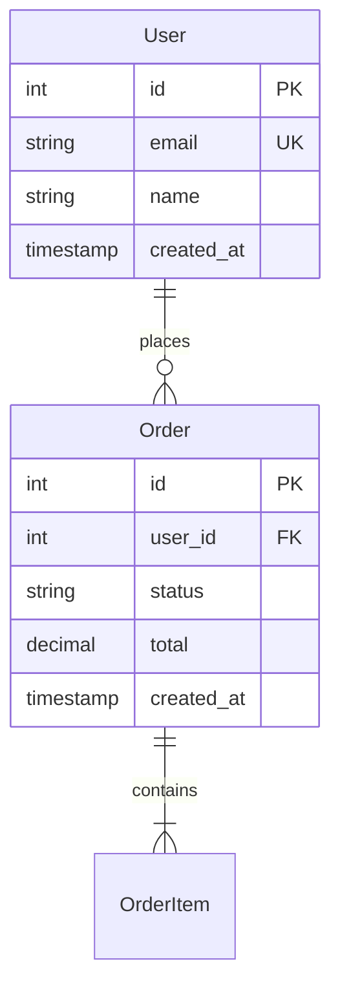

# DATABASE.md 编写规范

## 创建时机

首张数据表出现时创建。数据库 Schema 变更时更新。

## 文件位置

`docs/DATABASE.md`

## 模板

```markdown
# 数据库设计

> 最后更新：YYYY-MM-DD
> 引擎：PostgreSQL 15
> ORM：Prisma 5.x（如适用）

## 1. 概述

<!-- 数据库的整体说明：引擎、字符集、时区、ORM 选型理由 -->

- 字符集：UTF-8
- 时区：所有 `timestamp` 字段存储 UTC，应用层转换时区
- 迁移工具：Prisma Migrate

## 2. ER 概览

<!-- 核心实体及其关系 -->



## 3. 表定义

### users

用户账号信息。

| 列 | 类型 | 约束 | 默认值 | 说明 |
|----|------|------|--------|------|
| `id` | `SERIAL` | PK | 自增 | 主键 |
| `email` | `VARCHAR(255)` | UNIQUE, NOT NULL | - | 登录邮箱 |
| `name` | `VARCHAR(100)` | NOT NULL | - | 显示名称 |
| `password_hash` | `VARCHAR(255)` | NOT NULL | - | bcrypt 哈希 |
| `role` | `VARCHAR(20)` | NOT NULL | `'user'` | 角色：user / admin |
| `status` | `VARCHAR(20)` | NOT NULL | `'active'` | 状态：active / disabled |
| `created_at` | `TIMESTAMPTZ` | NOT NULL | `NOW()` | 创建时间 |
| `updated_at` | `TIMESTAMPTZ` | NOT NULL | `NOW()` | 更新时间 |

**索引：**

| 索引名 | 列 | 类型 | 说明 |
|--------|----|------|------|
| `idx_users_email` | `email` | UNIQUE | 登录查询 |
| `idx_users_status` | `status` | B-tree | 按状态筛选 |

### orders

用户订单。

| 列 | 类型 | 约束 | 默认值 | 说明 |
|----|------|------|--------|------|
| `id` | `SERIAL` | PK | 自增 | 主键 |
| `user_id` | `INT` | FK → users.id, NOT NULL | - | 下单用户 |
| `status` | `VARCHAR(20)` | NOT NULL | `'pending'` | pending / paid / shipped / completed / cancelled |
| `total` | `DECIMAL(10,2)` | NOT NULL | - | 订单总额 |
| `created_at` | `TIMESTAMPTZ` | NOT NULL | `NOW()` | 创建时间 |
| `updated_at` | `TIMESTAMPTZ` | NOT NULL | `NOW()` | 更新时间 |

**索引：**

| 索引名 | 列 | 类型 | 说明 |
|--------|----|------|------|
| `idx_orders_user_id` | `user_id` | B-tree | 按用户查询订单 |
| `idx_orders_status` | `status` | B-tree | 按状态筛选 |
| `idx_orders_created_at` | `created_at` | B-tree | 按时间排序 |

## 4. 关系说明

| 父表 | 子表 | 外键 | 关系类型 | ON DELETE |
|------|------|------|:--------:|:---------:|
| `users` | `orders` | `orders.user_id` | 1:N | RESTRICT |

## 5. 迁移历史

| 版本 | 日期 | 说明 |
|------|------|------|
| 001 | 2025-12-01 | 初始化：创建 users 表 |
| 002 | 2025-12-15 | 新增 orders 表 |
| 003 | 2026-01-10 | users 表新增 role 和 status 字段 |
```

## 章节要求

### 概述

- 标注数据库引擎及版本
- 说明字符集、时区策略、ORM/迁移工具

### ER 概览

- 用 Mermaid `erDiagram` 展现核心实体关系
- 仅画**核心表**（不超过 10 张），完整定义在"表定义"章节
- 每个实体标注关键字段（PK、FK、UK、业务关键列）

### 表定义

- 每张表一个三级标题，标题后附一句话说明表的业务用途
- 列表格包含：列名、类型、约束、默认值、说明
- 约束缩略语：PK（主键）、FK（外键）、UK（唯一）、NN（非空）
- 索引单独列表，标注索引名、列、类型和创建原因

### 关系说明

- 外键关系汇总表：父表、子表、外键列、关系类型、级联策略
- 关系类型：1:1、1:N、N:M（通过中间表）

### 迁移历史

- 按时间倒序
- 每条记录标注版本号和变更摘要

## 更新规则

| 事件 | 更新内容 |
|------|---------|
| 新增表 | "表定义" + "关系说明" + "ER 概览"（如为核心表） |
| 新增/删除/修改列 | 对应表的"表定义" |
| 新增/删除索引 | 对应表的索引表 |
| 新增/修改外键 | "关系说明" |
| 执行迁移 | "迁移历史" |
